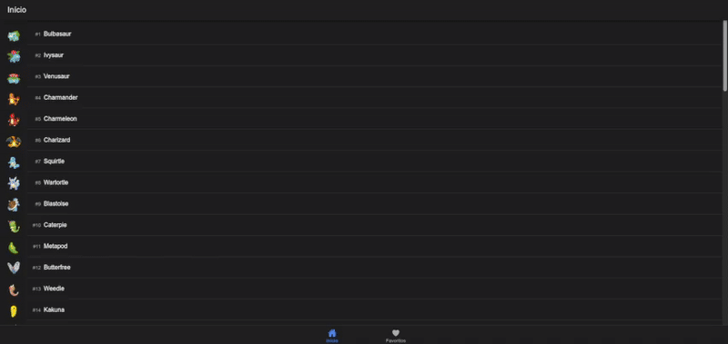
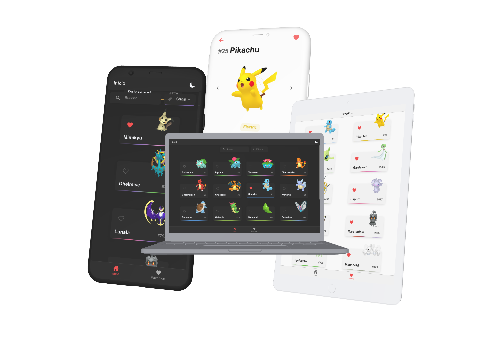

<h1> Pokédex Ionic + Angular </h1>
 

  Aplicativo de Pokédex multiplataforma desenvolvido em Ionic e Angular utilizando os serviços RESTful da API pública PokéAPI.

 
<a href="https://pokedex-ionic-angular.netlify.app/">Live Demo</a>

## Índice

- [Páginas](#páginas)
- [Boas Práticas](#boas-práticas)
- [Responsividade](#responsividade)
- [Deploy](#deploy)
- [Melhorias Planejadas](#melhorias-planejadas)

## Páginas

### Tela Principal

`/inicio/`

- Lista todos os Pokémons, exibindo Imagem, Nome e Id.
- Filtrado para ignorar variações, exibindo apenas os 1025 Pokémons em sua forma original.

> e.g. "#448 Lucario" é exibido, "#10059 mega-lucario" não.

### Tela de Detalhes

`/detalhes/:id`

Exibe detalhes de um Pokémon específico.

> - Id
> - Nome
> - Imagem
> - Tipo
> - Altura
> - Peso
> - Habilidades
> - Estatísticas

### Tela de Favoritos

`/favoritos/`

- Exibe os Pokémons que o usuário adicionou à sua lista de favoritos.
- Utiliza o Ionic Storage ([@ionic/storage](https://github.com/ionic-team/ionic-storage)) para armazenar os dados no IndexedDB e localStorage.

## Boas Práticas

### Estrutura de Arquivos

#### /components/

Componentes utilizados no projeto

> e.g. `Lista`, utilizado nas páginas `Início` e `Favoritos` para exibir uma lista de Pokémons com imagem, id e nome.

#### /pages/

Páginas do projeto

> e.g. `Início`, `Detalhes` e `Favoritos`.

#### /services/

Serviços do projeto

`PokeAPI`

Obtém dados da API pública [PokéAPI](https://pokeapi.co/).

> getPokemons() obtém uma lista de Pokémons.

> getPokemon() obtém detalhes de um Pokémon específico.

> getPokemonsDoTipo() obtém uma lista de Pokémons de um determinado tipo.

`Favoritos`

Gerencia os favoritos utilizando [@ionic/storage](https://github.com/ionic-team/ionic-storage)

> getFavoritos() obtém a lista de favoritos.

> setFavorito() adiciona um Pokémon à lista de favoritos.

> removeFavorito() remove um Pokémon da lista de favoritos.

> isFavorito() verifica se um Pokémon está na lista de favoritos.

`Busca`

Realiza busca por Nome e/ou Tipo do Pokémon.

#### /tabs/

Navegação por tabs, garantindo um botão de fácil acesso para `Início` e `Favoritos` em todas as páginas.

> O projeto foi incializado utilizando o template de tabs fornecido pelo Ionic, utilizando o comando `ionic start pokedex-ionic-angular tabs --type=angular`

### Controle de Versão

- Padrão de Commits: `Conventional Commits`
- Fluxo de Trabalho: `GitHub Flow`

## Responsividade

A interface foi adaptada para funcionar em diferentes dispositivos.

## Deploy

O aplicativo foi hospedado na plataforma Netlify e pode ser acessado em:

https://pokedex-ionic-angular.netlify.app/

## Melhorias Planejadas

- [ ] Criar testes unitários
- [x] Implementar busca por nome do Pokémon
- [x] Implementar busca por tipo do Pokémon
- [ ] Atualizar a interface

   

_
Projeto desenvolvido como teste prático para uma vaga de Desenvolvedor Full-Stack Jr.
_
